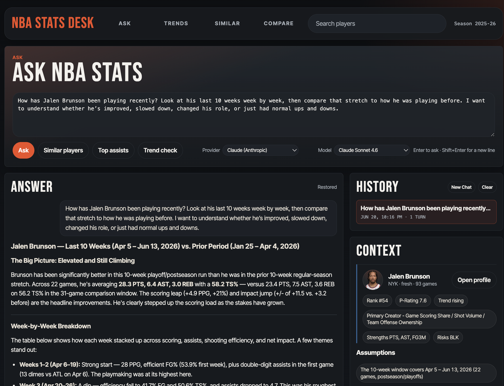
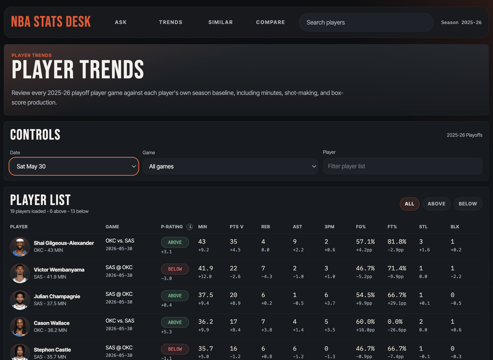

# NBA Stats Desk

[](https://github.com/mikeh-studio/nba-stats-desk/actions/workflows/ci.yml)
[](LICENSE)

Agentic, GCP-backed NBA intelligence workbench covering `2023-24` through `2025-26`. It
pairs a natural-language `/ask` stats agent that can call the OpenAI API or
Claude API with Performance insights for recent player form, backed by BigQuery,
dbt, Airflow, and a Cloud Run-ready FastAPI service.

**Platform scope:** dbt SQL models transform six NBA source domains into
curated gold serving models for a read-only FastAPI workbench and stats agent.



Core flow:

```text
NBA API + injury reports
  -> GCS
  -> BigQuery
  -> dbt gold + agent models
  -> FastAPI `/ask`, Performance, and stats APIs
```

Optional portfolio paths include Redshift Serverless as a secondary warehouse.

## What It Shows

- **Agentic Ask flow**: `/ask` plans questions, resolves players, asks
  clarifying follow-ups, calls allowlisted semantic tools, and returns grounded
  Markdown answers with charts, tables, assumptions, metric context, and
  browser-local chat history.
- **Performance insights**: `/performance` compares 2025-26 playoff player games
  against season baselines with filters, signed P-Rating, minutes, shooting
  metrics, and a lightweight player snapshot modal.
- **Research views**: player detail, comparisons, rankings,
  and a 3D player similarity map support deeper stat review.
- **What Changed?**: `/what-changed` separates top performers from surging
  players over four team games or complete calendar weeks, with availability,
  offense, defense, and individual game evidence. See the
  [metric contract and rollout notes](docs/what-changed.md).
- **Analytics engineering backbone**: source contracts, dbt models,
  orchestration, metadata, and read-only serving keep the public app tied to
  curated warehouse outputs.
- **Player similarity**: the public KMeans baseline is paired with
  Gaussian mixture, hierarchy, and density-scan candidate models, with
  deterministic training, output validation, and atomic publication.
- **Player context and evaluation**: governed shooting/minutes metrics and
  derived opponent/status relations, with offline evidence generation, independent
  model assessment, and human review. See [Player context](docs/player-context.md)
  and [Evaluation](docs/evaluation.md). Relational context remains descriptive;
  the offline generator is not enabled in the public request handler.

## Stack

- **GCP**: GCS landing, BigQuery warehouse, and Cloud Run-ready serving.
- **dbt**: bronze, silver, gold, and agent models for analytics and app APIs.
- **Airflow**: orchestrates extraction, source contracts, staging loads, DQ,
  bronze merges, dbt builds, similarity publishing, and run metadata.
- **FastAPI**: serves `/ask`, Performance, player, compare, similarity, and JSON
  APIs from curated gold, agent, and metadata tables.
- **Agentic tools**: query planning, player resolution, clarification handling,
  OpenAI API / Claude API calls, semantic metric tools, and evidence-bounded
  answer rendering.

## Data Domains

The pipeline ingests six source domains:

- player game logs
- team line scores
- player reference and roster context
- player shot locations
- upcoming schedule context
- official NBA injury reports

Game logs are the hard-gated source. Schedule, line score, and player reference
extracts can soft-fail after retries so a valid game-log run can still advance
when supporting endpoints are unavailable.

## Warehouse Outputs

The scheduled pipeline remains centered on `2025-26`. The app season selector
also serves isolated `2023-24` and `2024-25` archives. See
[Historical seasons](docs/historical-seasons.md) for backfill commands, dataset
names, validation, and source-coverage limits.

- **Bronze**: raw source tables and operational staging tables.
- **Silver**: cleaned source models plus enriched player-game rows.
- **Gold facts/dimensions**: player stats, team scores, scoring contribution,
  players, teams, and games.
- **Gold serving tables**: trends, rankings, player detail, compare, dashboard,
  recent performance workbench, availability, and search indexes.
- **Agent serving table**: `nba_agent.agent_player_search` is a dedicated
  player context table for `/ask` player resolution and answer grounding.
- **Similarity outputs**: feature input plus public baseline feature vectors
  and archetypes.
- **Runtime metadata**: ingestion state, source contract outcomes, and run log.

See [Architecture](docs/architecture.md) for the detailed table layout.
See [Player similarity](docs/player-similarity-model.md) for the public baseline
and publication contract.

## Public App

The FastAPI service serves read-only HTML pages and JSON routes from curated
gold, agent, and metadata tables. The root route redirects to `/ask`, making the
agent the default entry point while keeping Performance and directed research
pages one click away.

- ask, performance, player, compare, and similarity map pages
- recent game performance, change comparisons, and rankings
- player search/detail, game logs, percentiles, similarity, and health

The similarity map (`/similarity-map`) is a 3D PCA projection of the player
similarity vectors: players cluster by archetype, selecting one traces edges to
its true cosine-nearest matches, and each axis is labeled with the features that
drive it. A model selector lets readers compare the KMeans baseline, Gaussian
mixture, hierarchy, and density-scan groupings without moving the underlying
player coordinates.




The `/ask` page is enabled with `OPENAI_API_KEY` and/or `ANTHROPIC_API_KEY`.
It plans the question, resolves players from `nba_agent.agent_player_search`,
gathers evidence through allowlisted tools, and sends the final bounded context
to the selected OpenAI API or Claude API model. Answers render as concise
Markdown, while detailed chart/table payloads stay in the side panels. Browser
history is local by default, and arbitrary SQL is never exposed.

See [Public Service](docs/public-service.md) for route and agent details.

## Public Boundary

This repo is public-safe by design: it contains the data platform, source
contracts, dbt feature layer, public baseline similarity model, and read-only
app. Tuned personal-model code, generated reports, notebooks, model artifacts,
local chat logs, and real credentials should stay private. See
[Public / Private Boundary](docs/public-private-boundary.md).

## License

Code and documentation are released under the [MIT License](LICENSE). NBA data,
logos, trademarks, player headshots, and third-party API content remain subject
to their respective owners' terms.

## Local Quickstart

Create a virtual environment and install dependencies:

```bash
python -m venv .venv
source .venv/bin/activate
pip install -r requirements.txt
```

Create local configuration:

```bash
cp .env.example .env
```

Minimum useful local values:

```env
GCP_PROJECT_ID=your_gcp_project
BQ_PROJECT=your_gcp_project
GCS_BUCKET_NAME=your_gcs_bucket
BQ_DATASET_BRONZE=nba_bronze
BQ_DATASET_SILVER=nba_silver
BQ_DATASET_GOLD=nba_gold
BQ_DATASET_AGENT=nba_agent
BQ_METADATA_DATASET=nba_metadata
BQ_LOCATION=US
DBT_TARGET=dev
```

Run the app locally:

```bash
uvicorn app.main:app --host 127.0.0.1 --port 8001 --no-proxy-headers
```

App URL: `http://localhost:8001`

Airflow's local webserver also defaults to port `8080`, so use a separate app
port when running both services.

## Pipeline Quickstart

This repo supports host-based local Airflow without Docker. The `Makefile`
exports `.env`, uses repo-local `airflow_home/`, and falls back to
`.venv-airflow/bin/python -m airflow` when available.

Initialize Airflow:

```bash
make airflow-init
```

Run parser checks:

```bash
make airflow-parse
```

Start scheduler and webserver in separate terminals:

```bash
make airflow-scheduler
make airflow-webserver
```

Trigger a manual run:

```bash
make airflow-trigger
```

Run the bounded live validation harness:

```bash
make airflow-live-validate
```

Run a one-time full-season stats replay:

```bash
make airflow-backfill-season
```

Airflow UI: `http://localhost:8080`

See [Local Airflow](docs/local-airflow.md) for replay windows, API retry
settings, injury ingestion, bootstrap behavior, and validation details.

## Validation

Fast local checks:

```bash
python -m compileall dags app scripts tests
PYTHONPATH=. pytest
dbt parse --project-dir . --profiles-dir dbt/profiles --target dev
```

Warehouse-backed dbt tests and live Airflow validation require working GCP auth,
a BigQuery-enabled project, and project-specific `.env` values.

See [Validation](docs/validation.md) for the full QA matrix.

## Optional Paths

- [Redshift Secondary Warehouse](docs/optional-redshift.md)
- [Source Contracts](docs/source-contracts.md)

## Security Hygiene

- Do not commit credentials or local `.env` files.
- Keep GCP, OpenAI, and AWS secrets in ignored local config or a managed secret
  store.
- The public service is read-only and queries curated serving tables.
- Local Airflow logs, dbt logs, pipeline triage output, notebooks, and build
  artifacts are ignored by git.

## Model catalog maintenance

A daily catalog review workflow flags model availability changes without changing
Ask's selection. See [model catalog review](docs/model-catalog.md) for local checks,
GitHub Actions setup, and the three-question candidate compatibility smoke test.

## Documentation

| Guide | Purpose |
| --- | --- |
| [Architecture](docs/architecture.md) | Implemented data flow and serving boundaries |
| [Ask workspace](docs/ask-workspace.md) | Conversations, comparisons, and supported presentation |
| [Metric semantics](docs/semantic-contract.md) | Identity, scope, aggregation, units, and missingness |
| [Player context](docs/player-context.md) | Derived relations and interpretation limits |
| [Evaluation](docs/evaluation.md) | Reproducible checks and offline human-review workflow |
| [Public/private boundary](docs/public-private-boundary.md) | What belongs in the repository |

Public documentation covers implemented behavior and reproducible validation.
Research notebooks, detailed experiment results, internal plans, and tuning work
are maintained separately. CI verifies code and fixtures; it does not establish
live warehouse coverage or deployment readiness.
