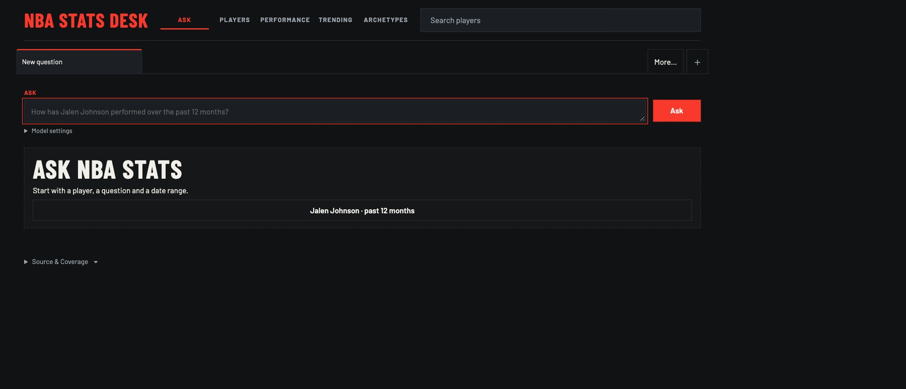

# NBA Stats Desk

[](https://github.com/mikeh-studio/nba-stats-desk/actions/workflows/ci.yml)
[](LICENSE)

Explore NBA players, ask basketball questions, and investigate changes in performance.
NBA Stats Desk connects a read-only web application to a governed data platform,
with explicit season scope, evidence-backed answers, and interactive charts.



## Explore

| Experience | What it does |
| --- | --- |
| **Ask** (`/ask`) | Resolves players and dates, gathers evidence through bounded tools, and presents answers with comparison context and charts. |
| **Players** (`/players`) | Search players and explore profiles, game logs, and statistical breakdowns. |
| **Trending** (`/what-changed`) | Compare top performers and changes in production over recent games or calendar weeks. |
| **Archetypes** (`/similarity-map`) | Explore a 3D projection of player features, baseline groupings, and nearest matches. |
| **Performance** (`/performance`) | Inspect playoff performances against each player's season baseline. |

Pages default to the latest supported season, currently **2025–26**. Ask supports
explicit historical questions within the available **2023–24 through 2025–26**
coverage. Availability varies by question and source; teammate comparisons describe
observed differences and do not establish causation.

## Engineering and evaluation

```text
NBA sources → GCS → BigQuery / dbt → FastAPI → Ask, Players, Trending
                    ↑
         Airflow orchestration and source checks
```

- **Data platform:** six source domains, source contracts, quarantine evidence,
  freshness tracking, and atomic publication of validated outputs.
- **Ask:** OpenAI, Anthropic, and OpenRouter adapters; allowlisted tools and governed
  calculations. The visualization specialist selects verified chart candidates;
  application code supplies their values. Arbitrary model-authored SQL is not exposed.
- **Archetypes:** a public similarity baseline and interactive model comparisons.
- **Evaluation:** deterministic semantic checks and offline model-review tooling.
  A public interactive evaluation showcase is not published yet; private runs are
  not evidence of general model superiority or production readiness.

Read the [architecture](docs/architecture.md), [Ask contract](docs/ask-workspace.md),
[archetype implementation](docs/player-similarity-model.md), and
[evaluation workflow](docs/evaluation.md).

## How the project evolved

1. **Data platform:** the initial ingestion and BigQuery pipeline grew into
   contract-checked sources, dbt models, and recoverable publication.
   See the [initial implementation](https://github.com/mikeh-studio/nba-stats-desk/commit/4d37b31)
   and [current architecture](docs/architecture.md).
2. **Interactive workbench:** player discovery, progressively loaded profiles,
   and shared research breakdowns made the warehouse explorable.
   See [Players discovery](https://github.com/mikeh-studio/nba-stats-desk/pull/60)
   and [research breakdowns](https://github.com/mikeh-studio/nba-stats-desk/pull/59).
3. **Governed Ask:** explicit scope checks, deterministic comparisons, and
   evidence-backed charts connect natural-language questions to inspectable
   statistics. See [Ask scope and comparisons](https://github.com/mikeh-studio/nba-stats-desk/pull/61)
   and the [current contract](docs/ask-workspace.md).

## Public code, private operations

The application, evaluation framework, and public baseline implementation are
available in this repository. Raw evaluation runs, conversations, review notes,
credentials, and proprietary model experiments stay outside Git. Only reviewed,
sanitized examples and concise summaries belong in public showcases.
See the [public/private boundary](docs/public-private-boundary.md).

The app supports Cloud Run deployment; this repository does not imply an active
public deployment. Public serving is read-only and currently has no account system.
Deployment configuration and access boundaries are covered in the
[public service guide](docs/public-service.md).

## Run locally

Use Python 3.11+ and configure access to your own populated BigQuery datasets:

```bash
python -m venv .venv
source .venv/bin/activate
pip install -r requirements.txt
cp .env.example .env
# Set project/dataset values and at least one provider key for Ask.
uvicorn app.main:app --host 127.0.0.1 --port 8001 --no-proxy-headers
```

Open `http://localhost:8001`. Ask accepts `OPENAI_API_KEY`, `ANTHROPIC_API_KEY`, or
`OPENROUTER_API_KEY` in the server environment. Keep `AGENT_HISTORY_ENABLED=false`
for public deployments. OpenRouter transport is covered by mocked tests; live
provider validation is still pending.

For pipeline setup and checks, see [Local Airflow](docs/local-airflow.md),
[historical seasons](docs/historical-seasons.md), and [validation](docs/validation.md).

## License

Code and documentation use the [MIT License](LICENSE). NBA data, logos, trademarks,
player headshots, and third-party content remain subject to their owners' terms.
